<!--Headings -->

# **Práctica 1: Configuración de entorno y red**

## **Objetivos de la practica**

Con el desarrollo de la práctica se espera que el estudiante aprenda como:

    1. Crear un entorno Linux virtual para evaluar servicios empleando herramientas como VirtualBox, Github y Docker.
    2. Identificar en Linux mecanismos para la identificación de ocupación de puertos y a qué servicio está relacionado
    3. Implementar un pequeño servicio cliente/servidor en Python empleando TCP y UDP, a partir de ello establezca cual es más adecuado para algunos contextos que le serán planteados.

## **Desarrollo de la práctica**

1. **Configuracion de entorno:** En este caso opte por usar debian ya que estoy un poco mas familiarizado con  el ambiente, ademas la maquina que ando usando fue dada por mi antiguo profesor de operativos, asi que esta bastante optmizada.

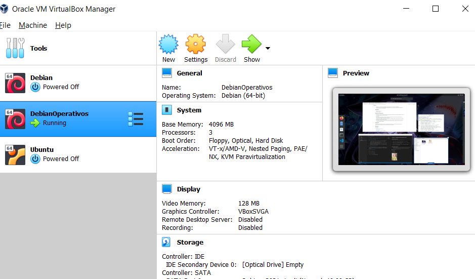

2. **Instalar docker** Captura del comando sudo docker, donde muestra que esta instalado en mi maquina virtual.

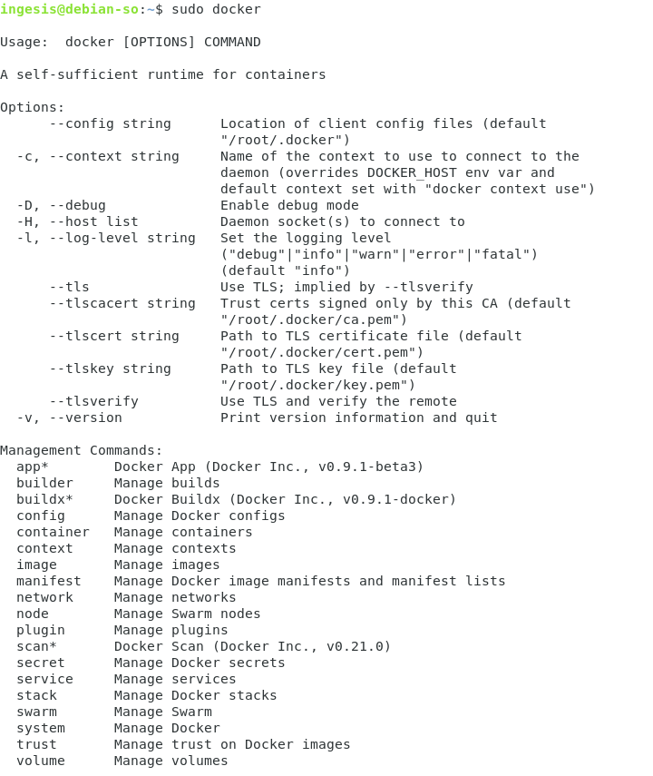

3. 
    * Reconocimiento de herramientas de red: Identificar configuración de red por medio del comando ip e ifconfig. 
    Podemos observar con el comando ifconfig las interfaces creadas 
    en este caso, al no funcionarme directamente el comando tuve que hacerlo con el comando que se puede puede observar en la imagen, tambien podemos notar que tenemos 3 interfaces donde la primera es la que creo docker y la segunda es la ip de la maquina virtual
    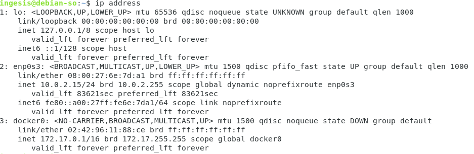
    aqui podemos ver un poco mas detalladas las direcciones que tenemos en el momento

    * Con el comando ss, podemos ver por ejemplo que puertos estan usados por el servidor X11, que en este caso es la interfaz grafica 
    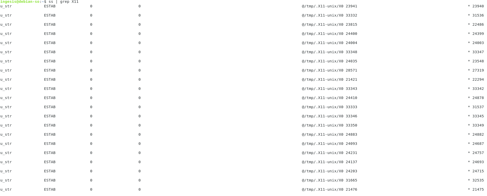

4. Identificacion de servicios desplegados: 
    * Desplegando el comando lsof podemos observar los servicios desplegados y a su vez podriamos deducir a que aplicacion puede estar relacionado
        * Systemd: a grandes rasgos podriamos decir que es nuestro sistema operativo (aunque en realidad es algo mas profundo).
        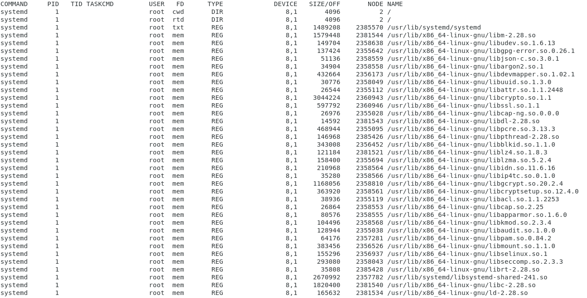
        * Avahi: Un daemon que permite a los programas encontrar los servicios de descubrimiento y conexión a través del protocolo mDNS/DNS-SD.
        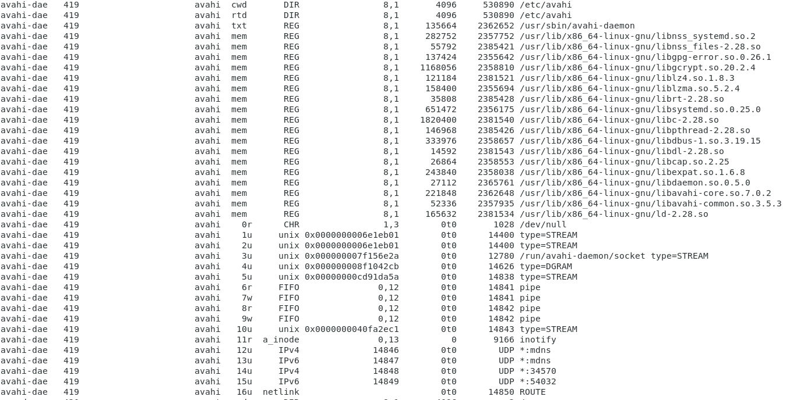
        * rsyslogd: es una utilidad de linux que permite reenviar mensajes de registro en una red IP. Esta implementado por un protocolo basico de syslog
        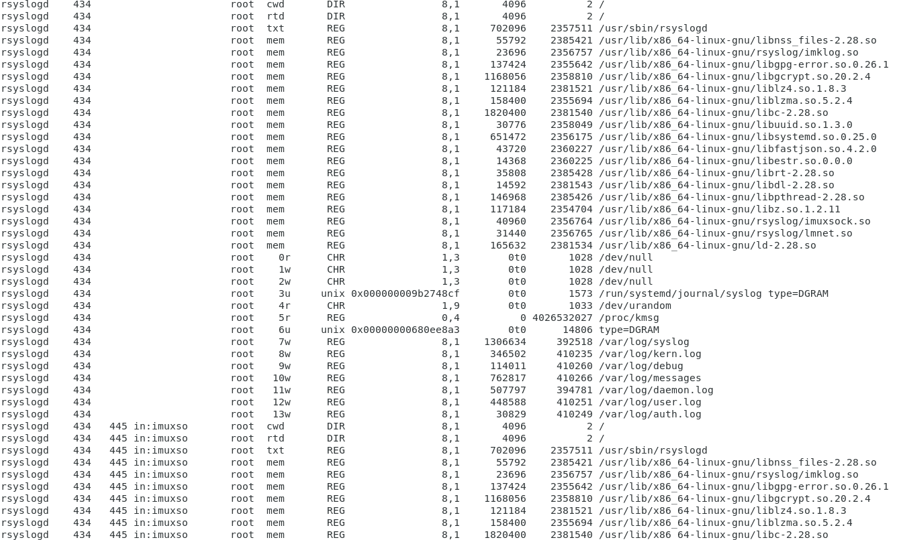
        * Xwayland: es uno de los muchos protocolos de servidor gráfico para linux
        
        * firefox-e: El navegador por defecto que linux 
        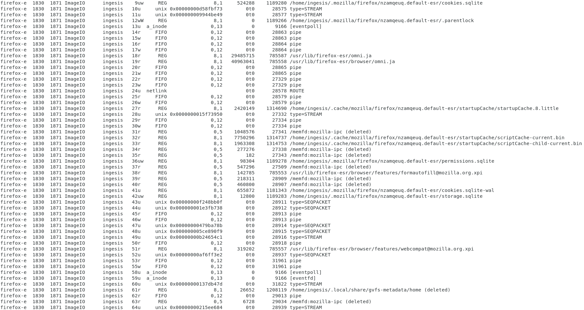

5. Evaluacion de los scripts en Python:
    Teniendo cuenta la practica, lo que pude observar corriendo los dos programas en python (uno con TCP y el otro con UDP), es que mandando el mensaje por UDP, llegaba directo en cambio el mensaje por TCP llegaba por trozos, para una prueba de esto las siguientes dos imagenes
    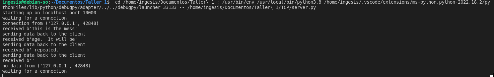
    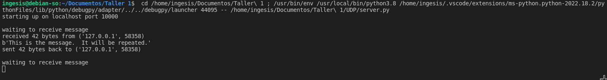
    Anexando a esto tambien podemos ver como en el cliente por TCP se recibia por pedazos, en cambio UDP mandaba el mensaje completo
    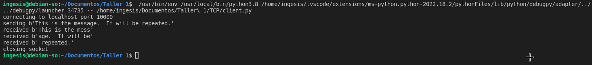
    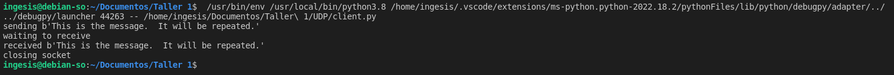
    Y por ultimo podemos observar por los puertos que escucha cada uno que en nuestro caso ambos escuchan por el puerto 10000
    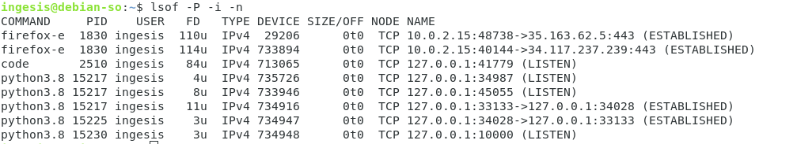
    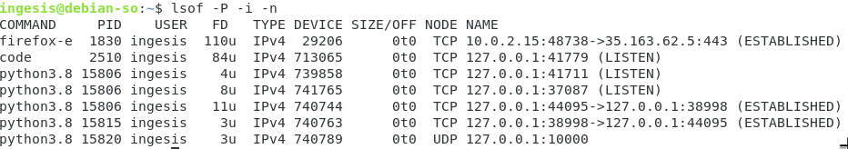

## Conclusiones

    * Como conclusion de esta practica, podemos decir que gracias a los comandos ss,netstat y lsof, podemos monitorear porque puerto las aplicaciones esuchan y a su vez detectar que tantas aplicaciones estan usando algun puerto sin que nos demos cuenta
    * Tambien podemos decir que aunque en este caso es un ejercicio netamente academico, el puerto UDP para este caso fue mas eficiente a la hora de enviar el mensaje ya que recibe mas caracteres y eso hace que sea mas practico.
