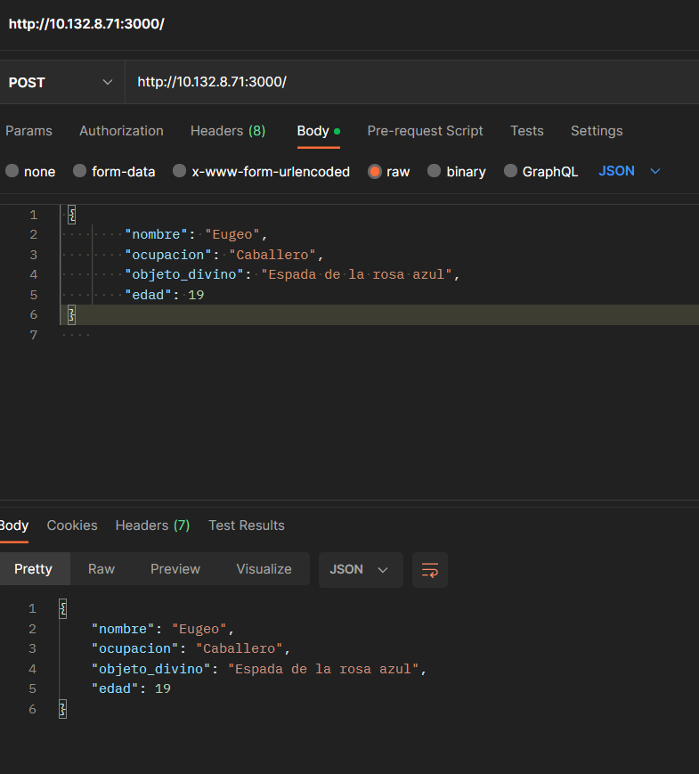
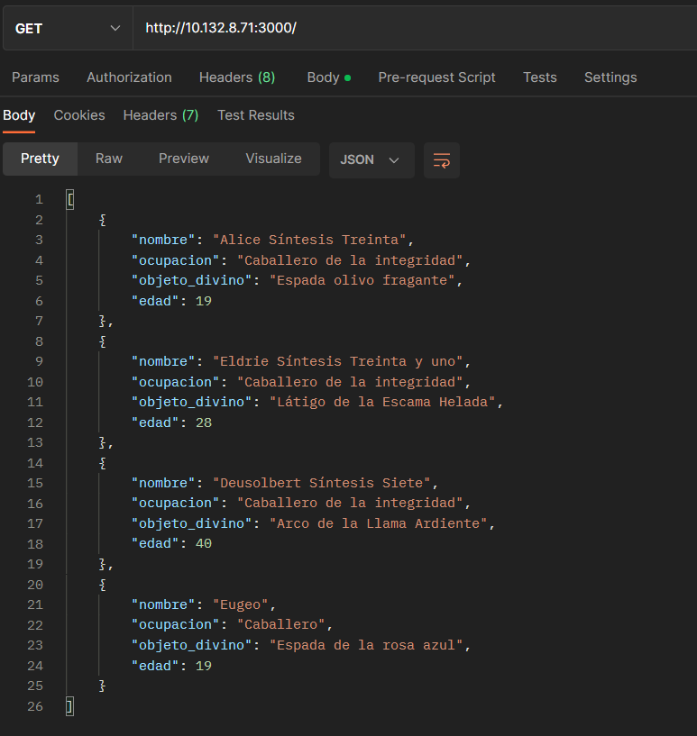
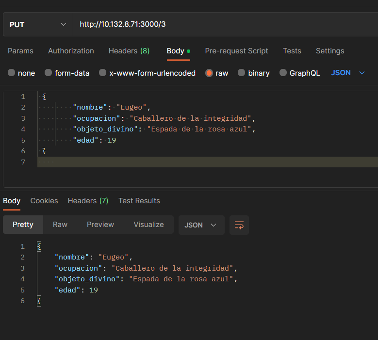
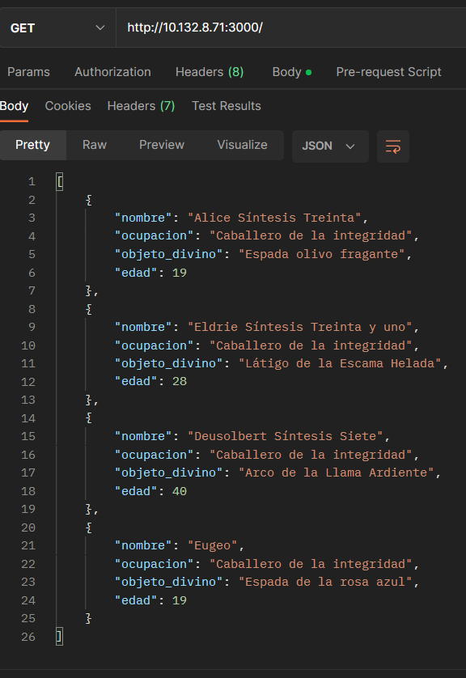
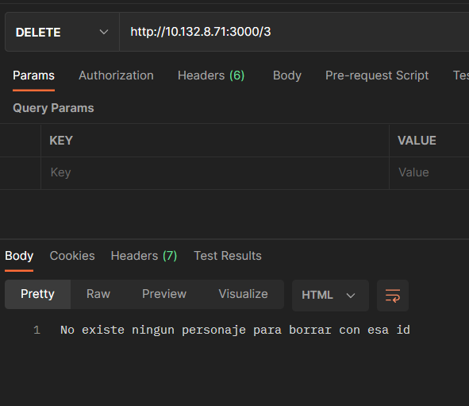
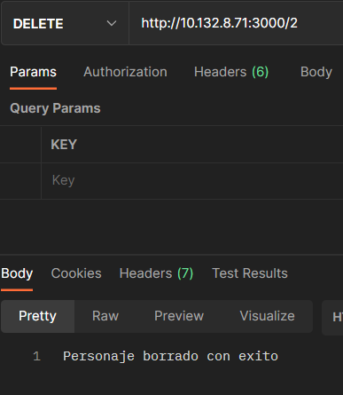
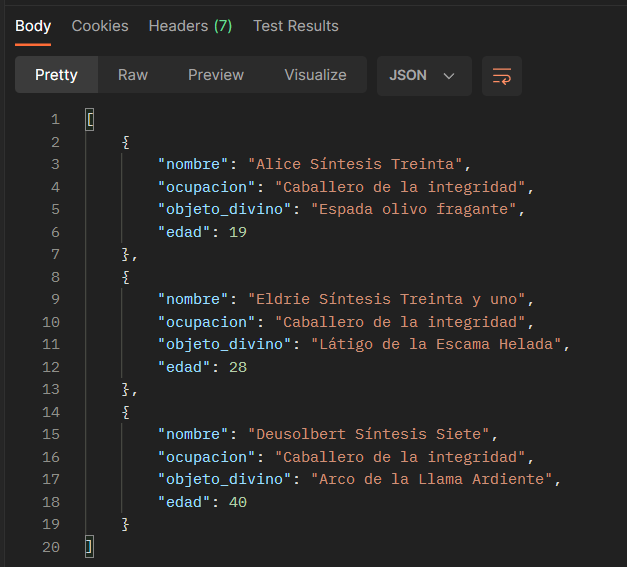
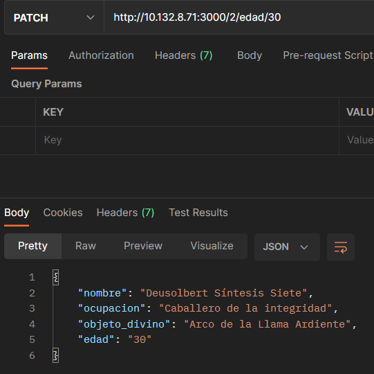
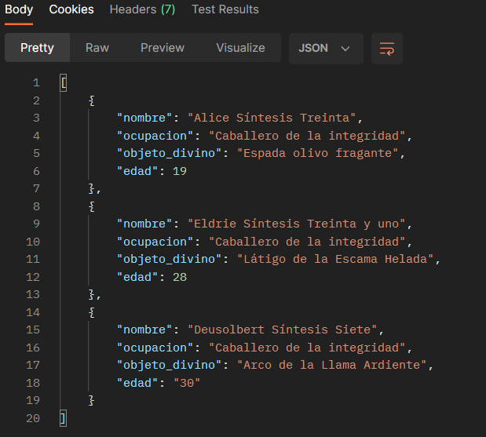

# **Práctica 2: Creando un servidor REST**

En esta práctica se completará la implementación de un servidor Web, es decir, empleando tecnologías de la World Wide Web expondremos información con el protocolo de Transferencia de Estado Representacional conocido como REST.

## Objetivos

  1. Instalar servidor NodeJS y NestJS.
  2. Implementar un servidor web que exponga un recurso REST.
  3. Publicar en GitHub el código fuente del servidor.
  4. Identificar los verbos Http y su uso para un caso de ejemplo.

  # Creacion del CRUD
  ## Personajes Sword Art Online: Allicization
  ### Nota: Todos los metodos fueron probados en POSTMAN
  ### Fecha de realizacion: 29/11/2022

  ## Creacion metodo POST: 
     en el caso del metodo POST, recibimos un JSON, donde guarda en nuestro array la nueva posicion junto a sus respectivos valores como lo muestran las siguientes imagenes

  
  

  ## Creacion metodo PUT:
    En el caso del metodo PUT, sabemos que este metodo actualiza un dato ya existe, y en el caso que no exista lo crea, en nuestro caso modificamos el dato que ingresamos en el metodo POST en el dato "ocupacion" pasamos de caballero a Caballero de la integridad

  ## Creacion metodo DELETE: 
    En el caso del metodo DELETE, tenemos que al ingresarle una posicion, eliminamos el JSON que esta guardado en la posicion especificada, tambien tenemos dos mensajes que nos dice si fue borrado con exito o no.

  
  

  ## Creacion metodo Patch
    Y por ultimo tenemos el metodo Patch, el cual dependiendo de la id y el parametro que le damos, cambia el valor del parametro que le enviamos, teniendo en cuenta que si no existe ningun dato en la posicion que le damos, este nos devuelve un mensaje de error, en nuestro caso modificamos la edad en la cual pasa de 40 a 30.

  
  
  

# Hecho por: Juan Carlos Mesa
