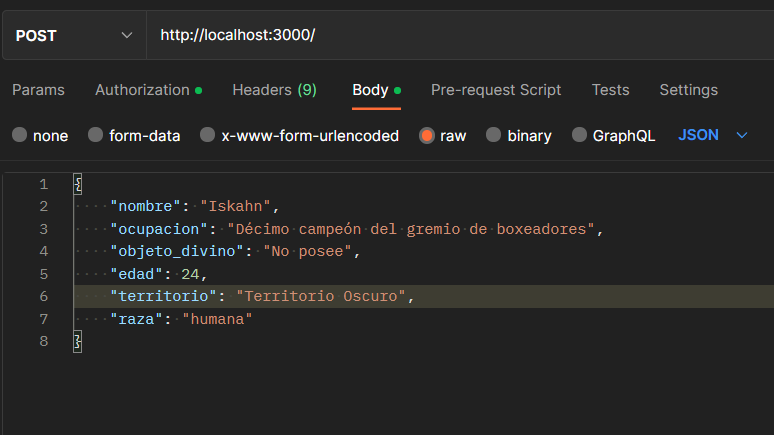

# Práctica 3: Seguridad y calidad

    Conseguir que el software funcione es solo la primera parte de crear un producto. Sin embargo, no es suficiente pensando el futuro. El software debe ser robusto, seguro y de calidad. La calidad se refiere a la capacidad de un producto de satisfacer las necesidades de los usuarios. La seguridad se refiere a la capacidad de un producto de protegerse de amenazas externas. La robustez se refiere a la capacidad de un producto de seguir funcionando en condiciones adversas.

    En esta práctica vamos a ver cómo podemos asegurar la calidad de nuestro software para garantizar su funcionamiento en el futuro.

## Objetivos

1. Aplicar los conceptos de arquitectura hexagonal.
2. Implementar protección simple de endpoints.
3. Implementar autenticación JWT.

# Pruebas del funcionamiento

Como vimos en la practica 2, la aplicacion esta basada en los personajes del anime Sword art online Arco Alicization teniendo en cuenta esto, tenemos el siguiente GET donde muestra los datos que guardamos para esta practica

Para mostrar el funcionamiento del login tenemos las siguientes capturas haciendo el POST, donde esta primer captura vemos que sin logearnos no podemos hacer uso de los metodos exceptuando el Get

Por lo tanto primero tenemos que hacer el login como se muestra en la siguiente captura y esta accion nos devuelve el token de acceso

Luego de esto agregamos el token (en este caso en POSTMAN ya que es donde estamos haciendo las pruebas)

Y ya para finalizar nuestro login podemos observar que al momento de agregar el token al Postman ya podemos hacer uso de los metodos

Podemos ver como se agrego el personaje que recien agregamos desde el post en el siguiente Get

## Delete

## Put

## Patch

Por ultimo el metodo patch, quise cambiarlo un poco y ahora podemos cambiar el nombre como lo vemos en las imagenes

