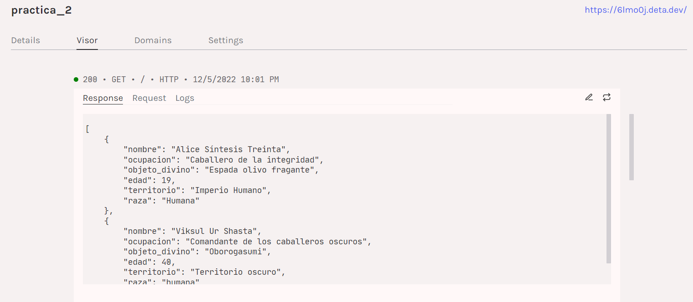

# Práctica 4: Desplegando en la nube
Desarrollar un servidor web en la nube es una tarea relativamente sencilla. En esta práctica vamos a desplegar una aplicación web en la nube utilizando un servicio de hosting gratuito.

## Objetivos
1. Desplegar una aplicación en la nube.
2. Agregar una base de datos a la aplicación.

# Desplegar una aplicacion en la nube

Utilizamos Deta Cli para subir la aplicacion en la nube, donde al hacer el paso a paso podemos ver donde nos presenta el siguiente link 
donde podemos ver en el buscador el link que nos dio Deta y a su vez al entrar al link los datos que tenemos por defecto.

Como evidencia de la practica tomamos las siguientes dos capturas, la primera donde estan todos los detalles de lo que subimos en la nube en este caso practica_2 

Y una segunda donde nos muestra el visor ya que en el paso a paso nos pedia activarlo 

por ultimo decir que fue un dolor de cabeza al inicio implementarlo pero cuando encuentras tus errores se puede ver que es bastante sencillo.

# Base de datos MongoDB

Para esta parte de la practica implementamos una base de datos con ayuda de MongoDB, para este caso hicimos las pruebas del funcionamiento con PostMan, 

1. Primero mostremos como nos aparece el GET cuando no hemos inyectado nada

2. Ahora hacemos un POST para inyectarle algunos datos a nuestra base de datos
ahora volvemos a hacer un GET para ver si nuestro inyeccion fue correctaPodemos ver que el id es automatico gracias a MongoDB

3. Ahora haremos un PUT con nuestro dato agregado

Y confirmamos con un GET para ver si fue correcto

4. Siguiendo con la practica ahora haremos un DELETE con el id que mongoDB le puso a nuestro dato

5. Por ultimo hacemos un PATCH en este caso cambiando el nombre de nuestro dato

y volvemos a comprar gracias a nuestro GET

Finalizando ya la practica como ultima evidencia podemos observar desde el gestor de MongoDB como nuestro dato estuvo luego de todas las pruebas que le hicimos sigue ahi

# Hecho por: Juan Carlos Mesa

